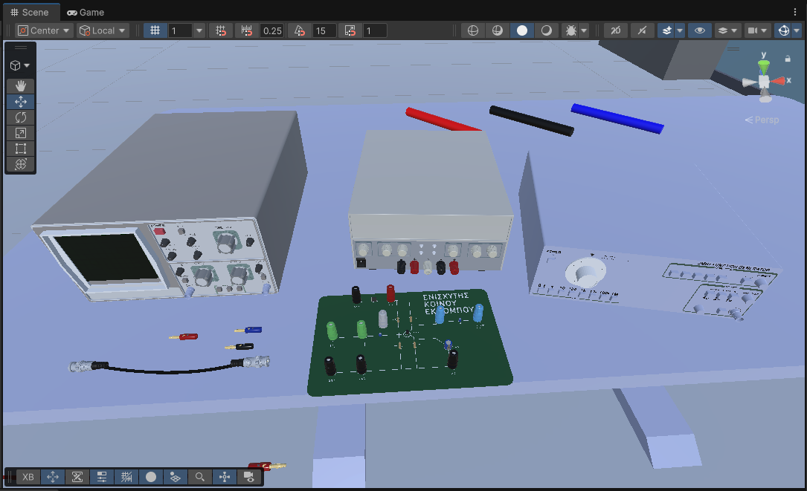
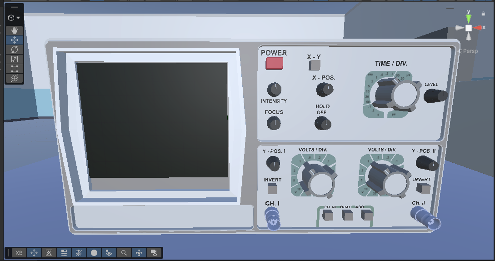
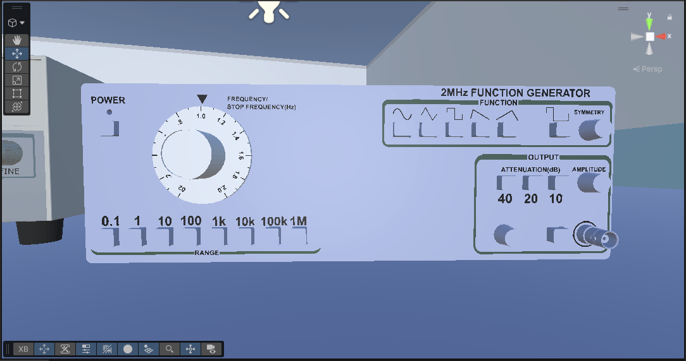
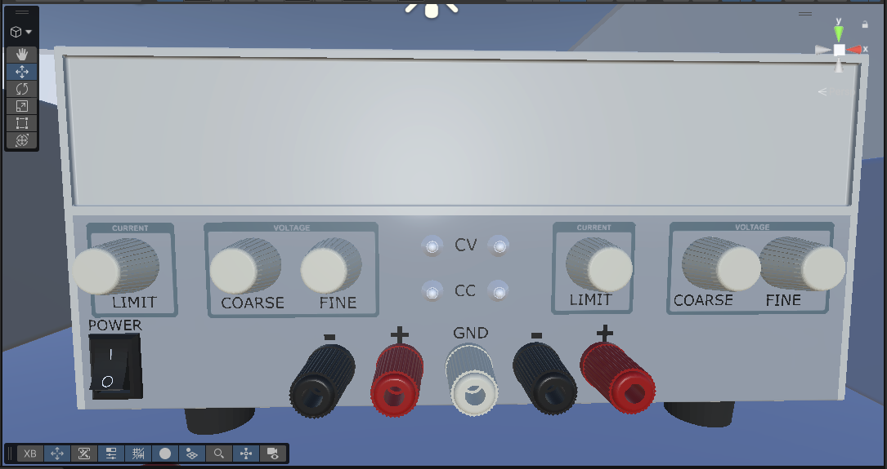
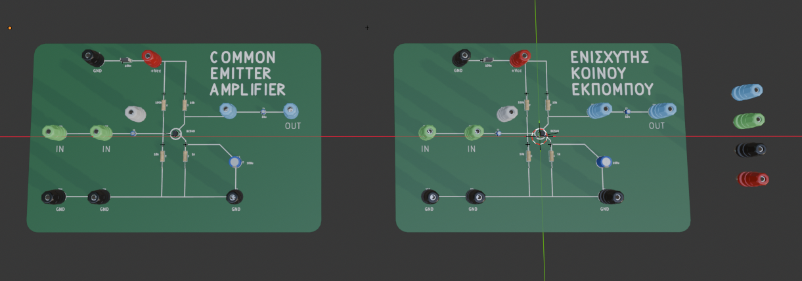
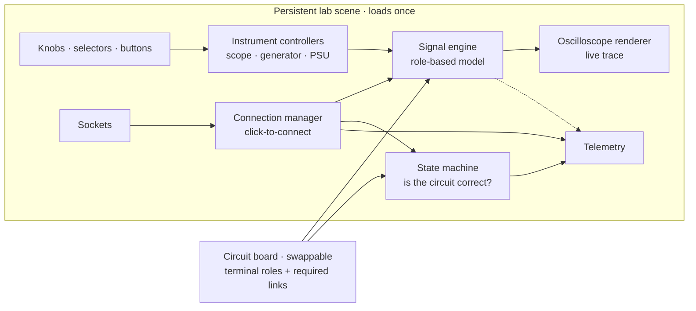

# Desktop-VR Electronics Lab

**Design and development of a desktop virtual-reality electronics laboratory for introductory instrument training**

Diploma thesis · Department of Electrical & Electronics Engineering · University of West Attica

<p align="center">
  
  
  
  
  
  
</p>

<!-- SCREENSHOT 01 -->


*The lab bench in the Unity scene (work in progress): oscilloscope, bench power supply and function generator, with the common-emitter amplifier board, a BNC cable and banana plugs.*

> [!NOTE]
> **This page is a project showcase.** The application is in active development as part of an ongoing diploma thesis and a related Ph.D. study. The source code and research material are not public yet. This page describes the project and shows its progress through screenshots.

---

## Contents

- [About](#about)
- [What the student does](#what-the-student-does)
- [The instruments](#the-instruments)
- [Experiments](#experiments)
- [Architecture](#architecture)
- [Technology journey](#technology-journey)
- [3D asset pipeline](#3d-asset-pipeline)
- [Telemetry and learning analytics](#telemetry-and-learning-analytics)
- [Guided learning layer (planned)](#guided-learning-layer-planned)
- [Development timeline](#development-timeline)
- [Current status](#current-status)
- [Roadmap](#roadmap)
- [Tech stack](#tech-stack)
- [Team and credits](#team-and-credits)
- [Rights and third-party assets](#rights-and-third-party-assets)

---

## About

This is a **virtual electronics lab** built in Unity. Undergraduate Electrical & Electronic Engineering students use it to practise with the three instruments at the core of every introductory analogue-electronics lab: the **oscilloscope**, the **function generator** and the **DC bench power supply**. They can practise as often as they like, at any hour, on a standard PC.

### The problem

Physical teaching labs have hard limits: scarce equipment, fixed access hours, cost, safety concerns with live circuits, and little room for individual guidance in large classes. Novice students face a further problem. In their first sessions they must do several things at once:

- identify unfamiliar instruments,
- wire a circuit correctly,
- configure each instrument,
- interpret the waveform on the screen.

Yet no course is dedicated to operating these instruments. They become a learning wall that students climb by trial and error, on shared equipment, under time pressure.

### The approach

The app recreates the university lab bench as a **desktop-VR** experience: a first-person 3D environment on an ordinary computer (keyboard and mouse), with no headset. Desktop VR runs on the lab PCs students already have. It also allows longer, comfortable sessions and is easy to deploy to a whole class. The architecture keeps a headset-VR mode possible later.

The project is the **technical deliverable of a Ph.D. study** on Desktop-VR instructional design in engineering education. It is built in two stages:

1. **A faithful, free-practice simulation** of the physical lab (current stage).
2. **A guided tutorial layer** on top: phases, hints and embedded assessment, instrumented to collect research data.

---

## What the student does

- **Operates real instruments.** They turn knobs, click selectors and press buttons on 3D replicas of the instruments in the university lab. Every control that changes the measurement works as it does on the real bench.
- **Wires circuits.** They connect instrument sockets to a circuit board with banana and BNC leads, using point-and-click: select one socket, then another.
- **Reads a live oscilloscope trace.** The scope shows whatever the probe is actually touching, including the results of mistakes.
- **Learns from realistic errors.** A forgotten ground gives a noisy, floating trace. A power supply that is switched on but not wired leaves the amplifier output dead (a flat line). A probe on the wrong node shows that node's signal. Mistakes look like they would on a real bench. They are never hidden or replaced by an error pop-up.

The current controls are:
- **Look** at a socket, knob or button to target it.
- **Press E or left-click** to press a button, or to select and then connect two sockets.
- **Scroll** to turn a knob.

A seated "bench view" with a free cursor is designed as the next refinement (see the [Roadmap](#roadmap)).

<!-- SCREENSHOT 05 (pending, once the signal chain runs in Play mode): docs/screenshots/05-connection-and-trace.png
     A connection in action: generator output wired to scope CH1, with the waveform on the scope screen. -->


---

## The instruments

Each instrument is a 3D replica of the model in the university lab. They were built from manufacturer datasheets, confirmed housing dimensions and reference photographs.

| Instrument | Real model | Housing (W × H × D) | Controls that affect the measurement |
|---|---|---|---|
| **Oscilloscope** | HAMEG HM203-6, 20 MHz dual-channel analogue scope | 285 × 145 × 380 mm | Power, channel mode (CH1 / CH2 / ADD), VOLTS/DIV per channel, TIME/DIV, vertical position per channel |
| **Function generator** | Leader LG1301, 2 MHz | 300 × 100 × 300 mm | Power, frequency (range buttons × dial), waveform (5 functions), amplitude, attenuator, invert |
| **Bench power supply** | EZ Digital GP-4303DU, dual-channel DC | 235 × 145 × 380 mm | Power, voltage (coarse and fine), current limit, digital readout |

The oscilloscope screen is a **real-time analogue-scope renderer**: a live, phosphor-style trace drawn from the simulation, not a pre-rendered animation.

> [!TIP]
> **Fidelity boundary: a deliberate design choice.** Every control a student would touch to *change a measurement* is live. Controls that only affect a physical CRT's appearance (intensity, focus, trigger level, hold-off) turn realistically but have no effect on the signal, because the simulated trace is always sharp and stable. Stating this boundary openly defines exactly what the simulation reproduces and what it simplifies.

<!-- SCREENSHOT 02 -->


*Oscilloscope (HAMEG HM203-6 replica). The panel labels are drawn in Inkscape and applied as decals. In Play mode, the real-time renderer draws the trace on the screen.*

<!-- SCREENSHOT 03 -->


*Function generator (Leader LG1301 replica): frequency dial, range buttons (×0.1 to ×1M), five waveform keys, attenuator, amplitude and the output BNC.*

<!-- SCREENSHOT 04 -->


*Bench power supply (EZ Digital GP-4303DU replica): two channels, each with current limit and coarse/fine voltage, plus CV/CC indicators and colour-coded output terminals.*

---

## Experiments

The lab uses the circuits students build in the introductory course. **Adding an experiment is a data task, not a coding task.** A new board needs only two things: the electrical role of each terminal, and its list of required connections.

| Experiment | Type | What the student learns | Required connections |
|---|---|---|---|
| **Common-emitter BJT amplifier** (headline) | Active, powered from the PSU | Powering an active circuit, gain, phase inversion, clipping | Generator → base · Scope CH1 → collector · PSU + → VCC · grounds |
| **Full-bridge rectifier** | Passive | Rectification, reading a non-sinusoidal waveform | Generator → AC in · Scope CH1 → DC out · grounds |
| **Emitter follower** | Active (same board, different probe point) | Unity-gain buffering | As the amplifier, with CH1 on the emitter |

Future candidates include a FET switching stage and an op-amp circuit.

<!-- SCREENSHOT 06 -->


*The common-emitter amplifier board in Blender, in English and Greek versions, with colour-coded banana-jack terminals.*

---

## Architecture

Two principles shape the whole application.

1. **The scene loads once.** The bench, the instruments, the wiring system and all managers stay alive for the whole session. Switching experiments swaps only the circuit board and its required connections. There is no scene reload.
2. **What the scope shows is separate from whether the wiring is correct.** The scope always draws the real result of the current wiring. A separate state machine decides whether the circuit is correct and records it for telemetry. This mirrors a real bench, where the instrument never "knows" the right answer.



### Building blocks

- **Reusable control layer.** Every control on the bench is an instance of one of four reusable components:
  - a continuous knob;
  - a detented selector that snaps to fixed engineering values;
  - a push-button, either momentary or latching;
  - a radio-button group.

  There is no custom script per control. A 20-control oscilloscope uses the same few components, each configured in the editor.
- **Per-instrument controllers.** One thin controller per instrument converts raw control values (a knob angle, a selector index) into engineering units (volts per division, hertz) and passes them to the signal engine.
- **Connection system.** Connections are logical: a socket-to-socket link recorded by a connection manager. Each socket carries an electrical role, such as generator output, transistor base, DC rail or ground. Every connect and disconnect is broadcast as an event that the signal engine, the state machine and telemetry all listen to.
- **Signal model.** This is a lightweight, per-role model, *not* a circuit solver:
  - The amplifier inverts and amplifies around a fixed operating point, and clips at the supply rails.
  - The rectifier returns the absolute value of its input.
  - Active boards are powered only when the PSU is switched on *and* both its + and ground leads are connected.

  The model is deterministic and real-time. That fits an introductory course, but it can't show faults that depend on component values.
- **Experiment state machine.** It moves through *loaded → partial connection → valid circuit → complete* by comparing the live connections with the experiment's required list, and it logs every transition.
- **Interaction.** All input goes through a single entry point on each interactive object. A future VR controller can drive the same entry point without a rewrite.

> [!NOTE]
> **A known limitation: dual trace.** The oscilloscope renderer draws a single trace. The data model tracks both channels, so the state machine and telemetry see everything. The screen currently shows one channel at a time, or their sum (ADD). A true simultaneous dual-trace display is planned as a rendering upgrade and needs no architectural change.

---

## Technology journey

Driving a believable, real-time oscilloscope trace was the central technical problem. Four approaches were evaluated before the current one was chosen:

| Stage | Approach | Why it was promising | Why it was dropped |
|---|---|---|---|
| 1 | **Python prototyping** | Quick maths and plotting | Not a path to an interactive, distributable 3D app. Unity links 3D, rendering and scripting in one free package. |
| 2 | **Real-time SPICE in Unity** (ngspice) | True circuit-level fidelity | Milliseconds per re-simulation hurts real-time response and comfort. Overkill for the teaching goal. |
| 3 | **Pre-recorded waveform tables** (captured from real instruments with LabVIEW) | No runtime solving cost | Gigabytes of data needed for smooth traces, and rigid: any setting that wasn't recorded has nothing to show. |
| 4 | **Real-time scope renderer + scripted model** ✅ | Full visual fidelity at low processing cost | Adopted. The trace is computed live from a lightweight model and drawn by a purchased real-time analogue-scope renderer. |

One engineering constraint came from the renderer itself. It samples the signal on a **background thread**, so the signal model must be pure, thread-safe maths. An independent code review found and fixed a real data race here: a noise buffer was being replaced on the main thread while the renderer read it on its own thread.

---

## 3D asset pipeline

```
Datasheets + photos  →  Blender modelling  →  Inkscape panel labels  →  Unity prefabs
   (dimensions,          (low-poly, materials,   (SVG → transparent      (controls, sockets,
    panel layout)         pivots, scale)          PNG decals)             scripts)
```

- **Reference first.** Housing dimensions come from datasheets and manual listings. Control positions that weren't published were estimated from the panel geometry and era-typical conventions, and the basis of each estimate was recorded.
- **Modelling and materials in Blender.** Knobs, switches and connectors are separate objects so each can move independently. Materials were assigned per face from a single reference photo per instrument. One domain-knowledge correction: the PSU's centre jack is *protective earth*, not circuit ground, so it isn't green.
- **Pivots and transforms.** Every rotating part has its pivot at its own centre, and a child object's pivot is independent of its parent's. Scale is audited before export so colliders aren't skewed in Unity.
- **Panel labels.** Label artwork is drawn in Inkscape. The first route, Blender Grease Pencil converted to a mesh, reached Unity as empty zero-vertex geometry, because FBX carries polygons only. The adopted solution is **one transparent PNG decal plane per label**, a fraction of a millimetre in front of the panel, with an **alpha-cutout** material. It is sharp at any distance and cheap to render.
- **Connectors.** Banana plugs, banana jacks and BNC connectors are adapted from community CAD models.
- **Safe re-imports.** Instruments are Unity prefabs. Model updates from Blender flow in without breaking the scripts attached to them, as long as object names stay stable.

The finished panel labels can be seen on the instrument close-ups in [The instruments](#the-instruments).

<!-- SCREENSHOT 07 (pending): docs/screenshots/07-blender-modelling.png
     An instrument mid-build in the Blender viewport (e.g. the bench PSU with materials and knob pivots). -->
<!-- SCREENSHOT 08 (pending): docs/screenshots/08-inkscape-labels.png
     Panel-label artwork in Inkscape (e.g. the VOLTS/DIV dial ring or the CURRENT / VOLTAGE group boxes). -->

---

## Telemetry and learning analytics

The research evaluates learning **inside** the application, not only with pre- and post-tests. The app therefore records *how* each student works.

- **What is captured.** Every connection, grounding choice, instrument setting, error, retry and idle period, across the **13 behaviour categories** defined by the research design. Each action is one timestamped row in a per-session event log (CSV). At the end of each session, the log is summarised into analysis-ready indicators.
- **Non-invasive by design.** The subsystem listens to events the application already broadcasts and reads its public state. It was added without modifying any existing code. Categories whose app feature doesn't exist yet (such as hints or a measurement step) have a ready one-line API, so they start recording as soon as the feature is built.
- **Built for a real lab.**
  - Local files are always written first and are the source of truth.
  - Sessions from many lab PCs can also be sent, encrypted and authenticated (AES-256 + HMAC-SHA256), to one evaluator machine on the lab network.
  - Number formatting ignores the PC's locale, so a Greek-locale PC writes the same decimals as any other.
- **Verified.** The encryption, the CSV contract and the scoring maths passed a 36-check standalone test harness. The subsystem compiles cleanly in the Unity Editor. In-scene validation is on the roadmap.

<!-- SCREENSHOT 11 (optional, pending): docs/screenshots/11-telemetry-sample.png
     A sample event log opened in a spreadsheet, using dummy data only. -->

---

## Guided learning layer (planned)

The instructional design comes from the Ph.D. research and is fully specified. It is the next major build stage. At a high level:

- **Three phases:** introduction → guided practice → independent assessment, with less support in each phase.
- **Progressive hints** that escalate automatically after repeated errors, rather than a single on/off help toggle.
- **A task checklist panel** that ticks off completed steps, a reference waveform to match, and a measurement step.
- **Embedded assessment**, computed directly from the telemetry already being collected.
- **Completion feedback** at the end of the activity.

Details of the instructional design and evaluation will appear in the research team's forthcoming publication.

---

## Development timeline

The project follows an iterative, documentation-driven process:

1. Design each subsystem against a stated requirement.
2. Implement it.
3. Review it.
4. Validate it before starting the next one.

Rejected approaches are documented as carefully as the chosen ones. A dated design record, with session logs, is kept throughout.

**May 2026: concept and technology selection**
- Defined the scope with the research lead: the three core instruments, a guided tutorial layer, and two teaching circuits.
- Evaluated the signal-generation approaches (see [Technology journey](#technology-journey)) and settled on a real-time scope renderer driven by a scripted model.
- Collected reference data (datasheets, dimensions, panel photos) for the three instruments, and set up version control and the design-notes vault.

**June 2026: 3D models and core systems**
- Modelled, textured and scaled the bench PSU in Blender, and set pivots for every rotating part. Modelled the oscilloscope.
- Solved the panel-label pipeline (Inkscape → PNG decals → alpha-cutout materials) after the Grease Pencil route produced empty meshes.
- Implemented the core systems: the signal engine and per-role model, click-to-connect wiring, the experiment state machine, the reusable control layer and the per-instrument controllers.
- Reviewed the integration against the oscilloscope renderer's source code. The review confirmed the design, fixed a background-thread data race, and removed dead code left over from the abandoned look-up-table approach.
- Implemented the telemetry subsystem and verified its core logic with a standalone test harness.

**July 2026: review and interaction design**
- Compiled and reviewed the telemetry subsystem in the Unity Editor, and identified follow-up fixes.
- Designed cable rendering and plug handling: a procedurally sagging cable, snap-to-socket, and a "held cable" interaction. Connections stay logic-driven, so physics can never create a false connection event in the research data.

**August 2026: integration and documentation**
- Turned all three instruments into Unity prefabs, and fitted the live oscilloscope display into the scope's screen bezel.
- Designed a seated "bench view" interaction model: a free cursor, limited camera pan, and click-to-inspect zoom.
- Modelled the circuit boards (common-emitter amplifier, rectifier) and the connectors (BNC cable, colour-coded banana plugs).
- Completed the first full draft of the thesis report.

**September 2026: now**
- The common-emitter board and the connector models are placed on the virtual bench.
- Fitting and evaluating the control scripts on the instrument models, to make the whole bench operable.

<!-- SCREENSHOT 10 (optional, pending): docs/screenshots/10-unity-editor.png
     The Unity Editor with the lab scene: the hierarchy on the left and a control component in the Inspector. -->

---

## Current status

| Area | Status |
|---|---|
| 3D models of the three instruments | ✅ Modelled, labelled and imported as Unity prefabs |
| Live oscilloscope display | ✅ Integrated into the scope model |
| Control layer (knobs, selectors, buttons) | 🟡 Implemented; being fitted to and evaluated on the instrument models |
| Connection system | 🟡 Implemented; in-scene evaluation in progress |
| Signal model and experiment state machine | 🟡 Implemented and reviewed against the renderer's source; in-scene evaluation next |
| Telemetry subsystem | 🟡 Implemented, core logic verified, compiles cleanly; in-scene validation pending |
| Circuit boards | 🟡 Common-emitter board modelled (English and Greek) and placed in the lab scene; sockets and wiring next |
| Cables and plug handling | 🟡 Designed; BNC cable and banana-plug models in the scene; interaction not built |
| Seated bench view and inspect zoom | ⬜ Designed |
| Guided lesson, hints and assessment | ⬜ Designed by the research team; not yet built |
| Pilot study | ⬜ Planned |

✅ done · 🟡 in progress · ⬜ not started

---

## Roadmap

**Thesis scope**
- [x] Reference data and 3D models for the oscilloscope, function generator and bench PSU
- [x] Core systems: signal engine, connection system, state machine, control layer, telemetry
- [x] Instruments as Unity prefabs, with the live scope display integrated
- [ ] Fit and evaluate the control components on all three instruments
- [ ] Prove the full signal chain in Play mode: generator → scope calibration, then every scaling control
- [x] Common-emitter amplifier board modelled and placed in the lab scene
- [ ] Wire up the board sockets and required connections (common-emitter amplifier first, then the rectifier)
- [ ] Seated bench view with a free cursor and click-to-inspect zoom
- [ ] Cable visuals and plug handling
- [ ] In-scene telemetry validation
- [ ] Guided lesson layer: phases, progressive hints, task checklist, measurement step, completion feedback
- [ ] Pilot test with a small group of students
- [ ] Final thesis report

**Beyond the thesis**
- [ ] True simultaneous dual-trace display
- [ ] More experiments (FET switch, op-amp)
- [ ] Headset-VR interaction mode
- [ ] Full-scale classroom study (led by the research team)

---

## Tech stack

| Area | Tools |
|---|---|
| Engine | Unity 6 LTS, Universal Render Pipeline, C# |
| Oscilloscope rendering | Ex Lumina *Real-Time Oscilloscope* (Unity Asset Store) |
| 3D modelling | Blender, plus reference CAD from GrabCAD for the connectors |
| 2D panel artwork | Inkscape |
| Version control | Unity Version Control (Plastic SCM) |
| Design record | Obsidian (living design notes and dated session logs) |
| AI-assisted development | Claude Code and Claude Cowork (Anthropic), and Unity AI, used for code scaffolding, review and troubleshooting. All design decisions, integration and validation are by the author. |

---

## Team and credits

| Role                                                                             | Person                                                                                                               |
| -------------------------------------------------------------------------------- | -------------------------------------------------------------------------------------------------------------------- |
| Development and engineering: 3D assets, Unity application, simulation, telemetry | **Vasilis (Bill) Gkionis**, diploma thesis, Dept. of Electrical & Electronics Engineering, University of West Attica |
| Research lead: instructional design, learning analytics, evaluation              | **Evaggelia (Eva) Zontou**, Ph.D. candidate, University of West Attica                                               |
| Supervision                                                                      | **Rangoussi Maria**                                                                                                  |

<!-- TODO: confirm with Eva how she'd like her name and title shown; add supervisor names and titles; add contact links (GitHub / LinkedIn / e-mail). -->

The application is the engineering counterpart of Eva's Ph.D. research on Desktop-VR instructional design for introductory electronics laboratories. A paper describing the instructional design and pilot study is in preparation by the research team.

---

## Rights and third-party assets

© 2026 the authors. All rights reserved. This repository contains **documentation and screenshots only**. No source code, models or third-party assets are distributed here.

- **Ex Lumina Real-Time Oscilloscope.** A commercial Unity Asset Store package, used under the Unity Asset Store EULA and not redistributed.
- **Connector models.** Adapted from GrabCAD community models; credit goes to their original authors.
- **Instrument names.** HAMEG, Leader and EZ Digital are trademarks of their respective owners. The virtual replicas are made for education only and imply no affiliation or endorsement.
